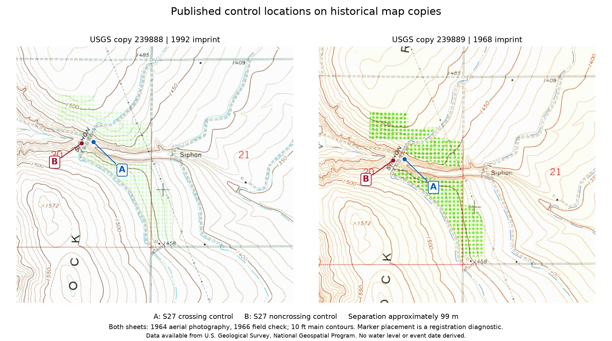

# Historical Babcock Ridge sheets and the flood-control datum question

2026-10-09. C008 / S27, S337-S339. Sourced draft; no independent field or hydraulic validation.

A bounded USGS Historical Topographic Map Collection query returned 14 products intersecting the two already inspected controls. Two are 1:24,000 Babcock Ridge sheets, both catalogued as 1966. Original GeoPDFs were acquired; full sheets, margins and local control-area crops visually inspected. The map copies have **1968 and 1992 imprints**. Both report aerial photographs taken in **1964** and field checking in **1966**. A later imprint, catalog update or digital modification date must not be substituted for terrain observation time.

| Original copy | Margin evidence | Date and datum limits |
| --- | --- | --- |
| [239888](../sources/originals/missoula/babcock-quads/239888.pdf), S337 | 1992 imprint; 10 ft main / 5 ft supplementary contours; NAD27 polyconic horizontal map; NGVD1929 vertical datum explicitly named | September 14, 1992 archive receipt stamp is a separate date. Does not establish which edition the flood authors used. |
| [239889](../sources/originals/missoula/babcock-quads/239889.pdf), S338 | 1968 imprint; 10 ft main / dotted 5 ft contours; NAD27 polyconic horizontal map; vertical wording is mean sea level | Do not silently replace this wording with an authenticated specific vertical datum. Same 1964/1966 survey lineage, not independent terrain confirmation. |

The known 20 ft interval in S27's crossing row therefore does **not match these two candidate sheets' printed main interval**. Neither the original quad edition nor field annotation used by the authors has been authenticated. This is a precise source-match gap, not proof of which entry is incorrect. All S27 values and intervals remain unchanged. Contour interval does not supply a statistical elevation uncertainty.

## Horizontal registration is required before reading a contour

The source controls are labelled WGS84; the historical maps print NAD27. The [executed registration](../analysis/babcock_page_locations.py) uses the pinned NOAA-derived CONUS and Washington/Oregon grids, the best available operation in the declared map area, and the embedded polyconic projection and affine page transform. The operation reports 1.5 m accuracy; that is not a measured uncertainty for the control or map. No vertical transformation was executed.

Embedded page registration values agree with their affine transforms to less than 0.000001 m. Calculated frame corners agree with the embedded neatline. These are internal checks of stored map registration, not millimetre-scale ground validation. Rounded map coordinates and printed raster geometry must not be assigned that apparent numerical precision.

The figure locates the published crossing and noncrossing coordinates approximately 99 m apart. The crop shows contour relief, orchard symbols, and a labelled siphon in the surrounding area. These mapped features require attention to human alteration and feature identity before comparing ground surfaces; they do not establish when any ancient flood occurred. No contour is interpolated into an exact corrected field elevation here. The existing [modern terrain comparison](LYNCH-BABCOCK-TERRAIN.md) remains a separate NAVD88 dataset and cannot directly validate these older heights.

## Preservation and next discriminating evidence

Original maps, query response and horizontal grid are preserved with [hashes and acquisition details](../data/babcock-quad-acquisition.json). The CONUS grid hash matches the provider catalog. Downloaded PDF byte sizes differ from catalog size fields; actual acquired bytes are hashed, without claiming a provider PDF checksum. GeoPDF digital creation/modification dates describe processing, not the historical survey. Poppler issued display-font warnings; visible map margins and raster content were inspected.

Recover the flood authors' actual quad edition/annotations and identify the observed divide/soil/erosion boundary. Establish the historical vertical reference, then select a justified vertical transformation if comparing it with modern NAVD88. A map showing a siphon does not prove that engineering caused the elevation discrepancy; an unavailable notebook does not prove that field evidence was omitted. A predictive flow model still requires paleo-terrain, stage outputs and authenticated one-sided controls.

Data available from U.S. Geological Survey, National Geospatial Program. The two historical sheets share a survey lineage and do not count as two independent discoveries or prospective prediction successes.

Reproduce from the repository root with `python analysis/babcock_page_locations.py`, then `python analysis/plot_babcock_controls.py`. Requires pypdf, pyproj, Pillow, matplotlib and Poppler `pdftoppm` on PATH (or the `PDFTOPPM` environment variable). The location script checks acquired-source hashes before calculation; the figure script renders its crops from the pinned original maps.
