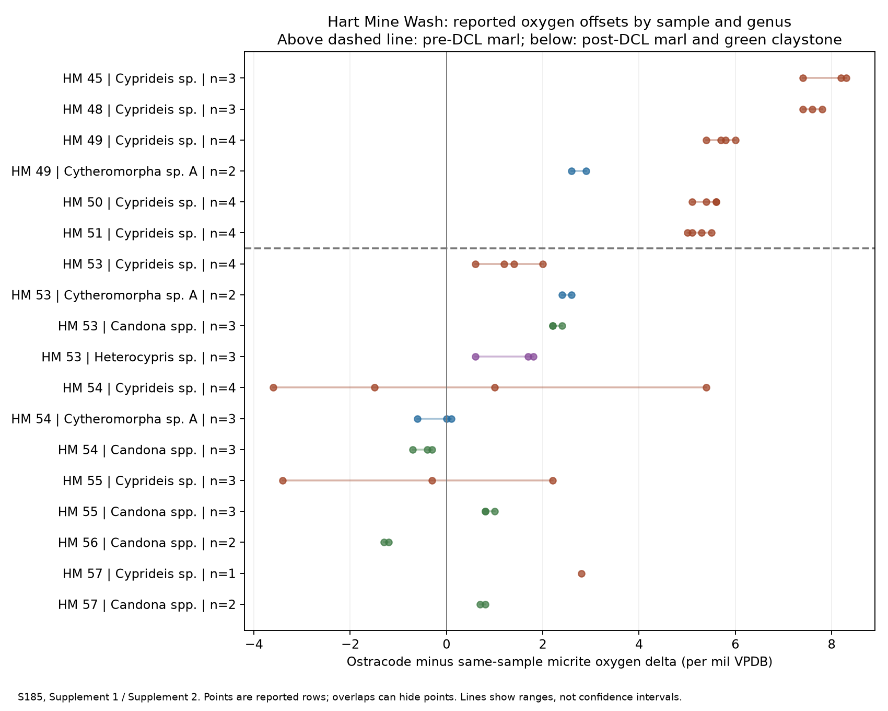

# Bouse oxygen isotopes: same-sample, same-genus comparison

Research draft, 2026-10-08. Retrospective analysis of S185; not independently reviewed.

The reported Cyprideis measurements support a shift toward smaller ostracode-minus-micrite oxygen offsets above the distinctive clay layer (DCL). This persists when genus is held constant, so replacement by different genera cannot alone account for that comparison. The data also contain substantial variation, a trend below the layer, and differences between genera. They do not establish a uniform instantaneous switch, its duration, or its unique cause.

## Reproducible comparison

Input is the [publisher's S185 workbook](https://www.sepm.org/supplemental-materials/207/download), identified by SHA256 in [the methods record](../data/bouse-methods.json). The [script](check_bouse_isotopes.py) requires that exact hash. Run `python research/check_bouse_isotopes.py path/to/downloaded-workbook.xlsx` with openpyxl and matplotlib installed. It produces [input records and calculations](../analysis/bouse-isotope-offsets.json) and the figure below. It does not modify the workbook.

For each of the 53 ostracode-result rows, subtract the micrite oxygen value from the matching sample in Supplement 1. Sample name, reported elevation and unit must agree across the two sheets. All 53 joins agree. The output retains all 24 sediment samples, all 53 isotope rows, their cell-range locators, and 18 sample/genus summaries. Means and minima/maxima are descriptive; no significance test or confidence interval is calculated.

Repeated result rows lack individual specimen identifiers. Their replication level is therefore unknown. Offsets within a sample share one micrite measurement and are not independent paired experiments. No measurement is removed as an outlier. Unmeasured taxa or sample combinations are not assigned zero.

The vertical axis is categorical sample/genus order, not scaled elevation or time. Each point is a reported result row; coincident points can overlap. Horizontal segments show observed ranges, not uncertainty intervals. The dashed line separates pre-DCL from post-DCL sample groups. The DCL itself has no ostracode isotope row in Supplement 2, so no offset is assigned to HM52.

## What survives the closer comparison

All offsets below are in per mil VPDB, computed as ostracode oxygen delta minus same-sample micrite oxygen delta. Numbers of rows are not established numbers of independent animals.

| Cyprideis sample | Position | Rows | Mean offset | Observed range |
| --- | --- | ---: | ---: | --- |
| HM45 | Pre-DCL | 3 | 7.967 | 7.4 to 8.3 |
| HM48 | Pre-DCL | 3 | 7.600 | 7.4 to 7.8 |
| HM49 | Pre-DCL | 4 | 5.725 | 5.4 to 6.0 |
| HM50 | Pre-DCL | 4 | 5.425 | 5.1 to 5.6 |
| HM51 | Pre-DCL | 4 | 5.225 | 5.0 to 5.5 |
| HM53 | Post-DCL marl/mudstone | 4 | 1.300 | 0.6 to 2.0 |
| HM54 | Post-DCL marl/mudstone | 4 | 0.325 | -3.6 to 5.4 |
| HM55 | Post-DCL marl/mudstone | 3 | -0.500 | -3.4 to 2.2 |
| HM57 | Green claystone | 1 | 2.800 | 2.8 |

The closest sampled Cyprideis groups on either side, HM51 and HM53, have mean offsets differing by 3.925 per mil and nonoverlapping reported ranges. They occur at reported elevations 111.02 and 111.35 m. The intervening 0.33 m is a sample-position gap, not the 0.03 m DCL thickness or a measured duration. This is evidence of a change between sampled horizons; temporal resolution still depends on sampling and deposition.

There is already a decline in offsets through the pre-DCL samples. The pre-DCL data should not be represented as one invariant baseline. HM54 also shows why a near-zero mean does not establish that every result agrees with micrite: its four Cyprideis oxygen values are -4.2, -13.2, -8.6 and -11.1 per mil (Supplement 2 E37:E40), against micrite -9.6 (Supplement 1 S15). The resulting offsets span 9.0 per mil. The four underlying values were also checked directly in the workbook XML, so this spread is not introduced by the reader library. Its cause remains unknown.

Genus matters. Pre-DCL HM49 Cytheromorpha has offsets 2.6-2.9, while Cyprideis in the same sample has 5.4-6.0. At post-DCL HM53, Cytheromorpha offsets are still 2.4-2.6. Thus a universal approximately six-per-mil pre-DCL offset collapsing identically for every genus would overstate these data. Later HM54 Cytheromorpha offsets approach zero (-0.6 to 0.1), while Candona is -0.7 to -0.3. Keep these trajectories separate.

## Interpretation and limits

The sample-level results are consistent with part of S184's proposed hydrochemical change. They challenge an explanation based solely on swapping the genera included in an aggregate comparison. They do not independently verify the assumptions that the micrite represents upper-water carbonate and every analyzed ostracode formed in place at the bottom. A genus label also does not establish identical species, season, habitat or preservation across samples.

Temperature, biological fractionation, diagenesis, reworking and within-sample heterogeneity require measured constraints before the offsets can uniquely diagnose water-column stratification or mixing. Listing them is not evidence that any one caused the observed spread. No temperature, salinity, water-isotope history or hydraulic parameters have been fitted here. The analysis supplies neither a new event age nor an isotope clock.

Next inspect original aliquot/specimen records and the environmental calibration behind each genus; reproduce the competing marine interpretation using its full assemblage and stratigraphic data. The [methods audit](BOUSE-METHODS.md) retains the rate-based timing estimate and fossil-boundary exceptions. Independent age controls and a specified connected channel remain necessary before associating these deposits with historical island maps.
