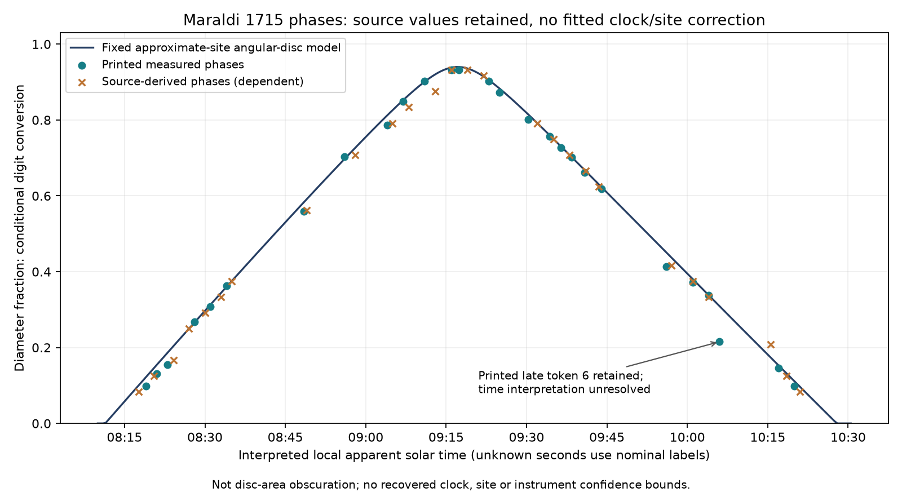

# Maraldi's eclipse phase sequence and instrumental limits

2026-10-09. BSBcanvases226-228/printed86-88 were visually inspected, completing Maraldi's short account in the [1715 reporting-year/1718 publication volume](https://www.digitale-sammlungen.de/en/view/bsb10500330?page=226). Printed86 previously supplied only the beginning; the continuation contains a clock method, two phase tables and exact contact seconds. No original manuscript, instrument, survey or clock log was authenticated. Official scans are linked/hashed in [the input ledger](../data/maraldi1715-inputs.json), not redistributed, under the manifest's NoC-NC1.0 designation. Attribution: München, Bayerische Staatsbibliothek;4Acad.117-1715,bsb10500330.

## Reported measurement and calibration

Maraldi places the observation at Châtenay, described as four minutes south of the Observatory and ten west. The western unit is not supplied in that inspected sentence; no geographic conversion is assumed. The selected modern-area coordinate used below does not follow from these numbers and is not an authenticated observing position.

He describes two methods: projection onto a card and a nine-foot telescope fitted with a micrometer, used with de Malezieu. The micrometer measures uneclipsed portions of the solar diameter, from which eclipsed extent is inferred. Thus the first printed phase table is already a processed report; it is not a set of recovered original micrometer divisions. The second table is expressly derived from the observations. The two tables are not independent witnesses.

Printed87 describes checking the seconds pendulum by solar altitudes shortly before the eclipse and by the Sun's centre passing the Châtenay gnomon at noon. Actual adjustment amounts and instrumental uncertainty remain unknown. This supports a conditional local apparent-time interpretation; it does not authenticate the clock or supply an error distribution.

## Transcription and executed comparison

All27 numerical extent rows of the primary phase table and26 rows of the derived table were transcribed. First contact is08:11:48 and final contact10:28:05. Spot events remain outside this numerical model. Minute-only labels retain unknown seconds; model evaluation at their nominal zero-second labels is explicitly distinguished from a recovered observation.

The [executed script](../analysis/maraldi1715_phases.py) uses Astronomy Engine2.1.19 at the fixed approximate Châtenay-area point48.768°N,2.277°E,height0m. Modern locality correspondence and actual instrument position are unverified. There is no fitted site, clock offset, date or radius. For each interpreted source time it calculates apparent topocentric angular Sun/Moon positions and radii, using the library's solar radius695700km and polar lunar radius1736km. The angular diameter fraction is `(solar_radius + lunar_radius - separation)/(2*solar_radius)`, bounded below by zero. This is a smooth-disc diagnostic, not a lunar-limb or projection-instrument reconstruction.

Digit conversion conditionally uses12digits per diameter and60minutes per digit. It does not convert digits to covered **area**. Instrumental scale, orientation, rounding and errors remain unvalidated. The [full results](../data/maraldi1715-results.json) retain every row and its source locator, including mismatches.

|Quantity|Source|Fixed model|
| --- | --- | --- |
|First contact|08:11:48|08:11:22.662,25.338s earlier|
|Maximum extent|11digits11minutes at09:16 and09:17:20|Peak09:17:08.928,diameter fraction0.939988|
|Final contact|10:28:05|10:27:54.877,10.123s earlier|

The converted reported maximum is0.931944 of diameter, about0.008044 below the model peak. That difference is retained, without an invented acceptance tolerance. The model peak lies between the two printed maximum-phase labels, but their spacing is not a measured timing confidence interval. All53 phase rows are dependent observations/derivations from one account, not53 independent chronology anchors.

The figure was rendered and visually inspected. It shows the broad rise/fall pattern and contrary entries together. For the primary table, model-minus-interpreted-source differences range−0.006182 to+0.093831 of diameter. The largest occurs at the late printed minute token6, provisionally carried as10:06: its2digits35minutes differs substantially from the model. A missing leading1 or another source/transcription problem is possible but unproven. The original visible token is retained rather than replaced with16. Source-derived rows also disagree with the model, ranging−0.033934 to+0.045604; they are not substituted for the first table to improve a fit.

## Consequences and next test

The account adds a different site and a documented calibration method, with a reproducible phase sequence broadly compatible with the partial eclipse. It does not establish precision agreement, physical age/custody of the edition, a chronology break or a worldwide event. The approximate coordinate, true-time interpretation, digit convention, smooth-disc geometry and shared orbital/rotation assumptions remain explicit. The same Academy volume/event also creates dependence with Delisle and de Louville.

Next compare additional editions to resolve the late time token and derived-table differences; recover original measurements, site/gnomon and clock adjustment records; then test positional, rotation and limb/instrument sensitivity. Additional separately dated events are still needed for a common chronology transformation. All twenty objectives remain active; no independent review or prospective confirmation is claimed.

Reproduce with `python analysis/maraldi1715_phases.py` (Astronomy Engine2.1.19 and matplotlib). Historical UT labels use modern library formatting, not atomic UTC in1715.
