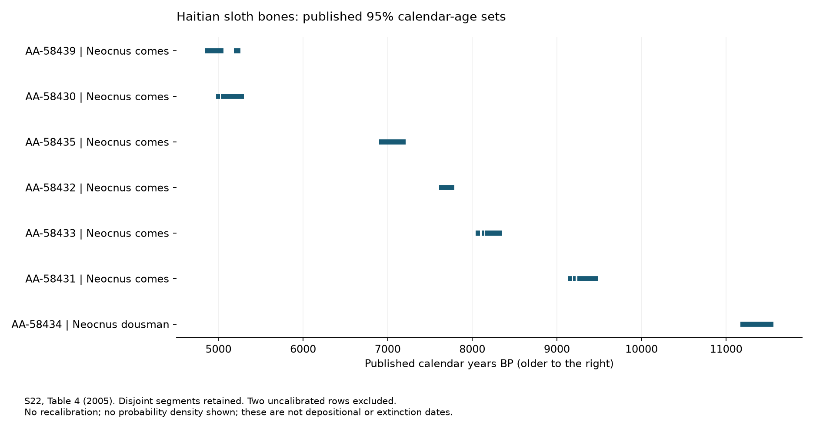

# Haitian sloth dating: specimen ages versus event ages

Research draft, 2026-10-08 (America/New_York). C011/S22; no independent review.

## Source and extracted evidence

[Steadman and colleagues (2005)](https://pmc.ncbi.nlm.nih.gov/articles/PMC1187974/) report nine AMS bone dates in Table 4, from Haiti and Ile de la Tortue. The HTML table, caption, Figure 2 caption and relevant chronology discussion were inspected. The supplementary link returned a browser-check page; laboratory preparation details were not audited. No physical specimens or original lab worksheets were examined.

The complete nine-row Table 4 extraction is in [dating records](../data/dating-records.json), identified by laboratory and museum numbers. Radiocarbon ages and published calendar intervals remain separate; calendar ranges are reported at 95% confidence. Disjoint intervals remain disjoint. AA-58436 is a lower bound (>14,200 radiocarbon years BP), not an exact age; two rows lack calendar ranges. The publication uses OxCal 3.9. No recalibration was performed here.

The authors distinguish last appearances from actual extinction and state that their AMS dates alone do not demonstrate human causation. Their continental comparison compiles earlier studies; it is not independently re-audited here. This audit concerns the 2005 measurements, not a claim that the paper's broader archaeology or taxonomy represents current consensus.

## Tests this makes possible

The proposed catastrophe contains several separable temporal claims:

| Proposed claim | Required test | What these records supply |
| --- | --- | --- |
| These animals died in one short episode | Direct biological ages consistent with one declared window, after preparation and calibration audit | Identified bone samples with reported ages; no fitted common-death model |
| Older remains were moved together later | A separately dated depositional horizon, transport indicators and provenance connecting the remains | No verified common depositional horizon in this extraction |
| A regional population became extinct at a specified time | Sufficient geographic and temporal sampling, preservation/detection assessment and an extinction model | A purposive set of dated specimens; no census of final survivors |
| Geographic upheaval created the observed range | Dated terrain changes, feasible routes and habitat evidence linked to identified populations | Site names and reported elevations; no reconstructed corridor |

An older bone incorporated into a younger deposit would not require its biological age to equal the deposit age. That possibility must be supported with stratigraphy and taphonomy, rather than added solely to rescue a failed date match. Conversely, uncertainty about exact extinction cannot erase positive evidence of an animal living at the time represented by a reliable direct date.

Different species, localities and dated elements remain separate records. Multiple bones under one laboratory identifier are not automatically independent animals or independent measurements. All nine rows share a publication and laboratory context; copying them into this inventory does not create replication. Unknown coordinates remain null; a site name or elevation is insufficient for a precise plotted point.

## Executed interval comparison

The [calculator](../analysis/sloth_intervals.py) reads the structured rows and writes a [result file](../analysis/sloth-intervals-result.json), including a canonical input hash. Run `python analysis/sloth_intervals.py`; add `--plot` with matplotlib installed to regenerate the figure. The published figure used matplotlib 3.11.2. The numerical calculation itself uses only Python's standard library.

This is a retrospective descriptive check of a **simultaneous biological-death interpretation for these selected specimens**. It is not a test of every possible upheaval, and the sample set was not selected prospectively. Seven rows have published calendar intervals; AA-58436 and AA-58438 are excluded because they do not. Their radiocarbon dates/bounds cannot be substituted onto this calendar axis.

| Included set | Common intersection | Shortest window touching every sample's interval set |
| --- | --- | --- |
| All seven calibrated rows | Empty | 5,910 calendar years; endpoint witness 5,260–11,170 cal BP |
| Six calibrated *Neocnus comes* rows | Empty | 3,870 calendar years; endpoint witness 5,260–9,130 cal BP |

The first minimum has a simple independent arithmetic check: AA-58439's oldest allowed endpoint in this extraction is 5,260, while AA-58434's youngest is 11,170. Their gap is 5,910 years. A window with those endpoints also touches each intervening sample's set, so the lower bound is attained. For the same-species subset, AA-58431 supplies the 9,130 endpoint instead. Disjoint ranges are not filled in during intersection calculations.

**These numbers are not 95% lower confidence bounds on event duration.** Individually reported 95% sets have omitted probability tails and are not a joint probability model. The calculation uses neither likelihoods nor shared calibration/laboratory errors. It establishes only that an instantaneous common death cannot sit inside all the reported sets as transcribed. It does not infer the probability of simultaneous death, date a final extinction, or exclude later movement of older remains.

The result challenges treating this selected collection as a contemporaneous death assemblage. A single later depositional event remains a different proposition requiring its own stratigraphic evidence; no such common horizon has been demonstrated here. Preparation audits, current calibration and later redating could change the inputs and must be recorded as revisions rather than silently substituted.

## Next work

### Later evidence from one of the same sites

[Cooke and Crowley (2022), S36](https://doi.org/10.1177/09596836221101279) reports eight new rodent dates from Trouing Jérémie #5, the site of sloth AA-58431. These are different specimens, not sloth redeterminations. The [eight-row transcription](../data/haiti-rodent-dates.json) retains museum and UCIAMS identifiers, atomic C:N, radiocarbon results and the published two-sigma calendar ranges. Relevant methods/context were read in the [NSF-hosted article](https://par.nsf.gov/servlets/purl/10336169), and Table 2 was visually checked.

The methods describe acid demineralization, base treatment, gelatinization, filtration and collagen-quality assessment. Atomic C:N values are 3.3–3.6; individual collagen yields are not tabulated here and stay unknown. Calibration used IntCal20 and Calib 8.2. This documents reported procedures, not an independent contamination test.

The table's oldest range is 10,806–11,184 cal BP for UF 293822; the youngest is 289–429 cal BP for UF 293847. Their separation supports a collection containing biological material of different ages. It does not, by itself, prove uninterrupted sediment accumulation or date each specimen's entry into the sinkhole. The authors interpret prolonged accumulation; excavation positions and taphonomy are needed to discriminate that from later mixing.

Table 2 labels one summary column “Mean ± 1σ,” but its footnote describes rounding two-sigma ranges to construct that summary. Preserve the labeling discrepancy; do not treat the half-range as a Gaussian standard deviation or replace the original range with it. Calibration probability structure was not reproduced.

No later remeasurement of AA-58439, AA-58434 or AA-58431 was established by this limited search. Their original preparation audit remains open. These new measurements add site context without independently verifying the earlier sloth assays.

### Remaining checks

Retrieve preparation protocols, collagen-quality measures, original determinations and excavation context. Check later redating and taxonomic revisions by specimen identifier. Recalibrate only with an explicitly named curve, software/version and justified reservoir assumptions; retain the original published results beside any new calculation.

Extend coverage to directly dated continental material and additional island samples before estimating extinction timing. Keep tests of death, deposition, migration and extinction distinct. No global event, cause of extinction, or historical rewriting follows from this extraction.

## Specimen-quality audit update

The author-uploaded [main-text mirror](https://www.researchgate.net/publication/7673942_Asynchronous_extinction_of_late_Quaternary_sloths_on_continents_and_islands) supplies the purified-collagen description and Table 4 carbon-isotope values. The [quality ledger](../data/sloth-quality-audit.json) joins all nine values to laboratory and museum identifiers, including the three endpoint specimens used in the interval comparison. It records unrecovered controls as null.

No specimen-level collagen yield, C:N ratio, treatment protocol, blank or replicate result was recovered in the inspected text. This is a limit of this audit, not a finding that the laboratory did no such work. The supplementary material and original laboratory reports remain uninspected. The table's isotope values cannot stand in for those missing checks; their explicit units were not supplied in the inspected table and are not invented in the ledger.

The interval calculations are unchanged. They remain conditional on published ages, not validated mortality inferences. Neither missing quality information nor a surprising age is sufficient reason to erase a measurement. The next decisive evidence is the specimen-specific laboratory record or a documented repeat assay, preserving the original result alongside any revision.

## Identified redating comparator

[Campo Laborde, C022](CAMPO-LABORDE.md) provides a separate same-specimen chemical-fraction redating example. It does not change any Haitian input. A fresh bounded search by endpoint lab IDs and preparation terms recovered no Haitian remeasurement; PMC main access returned browser verification and Europe PMC returned HTTP 500 for the 2005 full text. Those access failures supply no evidence about sample validity.

## Cuban comparator: chronology and failed dating kept separate

[MacPhee, Iturralde-Vinent and Jimenez Vazquez (2007), S140](https://doi.org/10.18475/cjos.v43i1.a9), pp.94-95, reports a dated *Megalocnus* tooth from Solapa de Silex and younger human remains. [Transcribed records](../data/sloth-cuba-comparator.json) preserve the assay, separate calendar intervals, and an unsuccessful protein screen for two *Parocnus* teeth. The author-uploaded text was inspected; laboratory certificates remain unavailable.

This is a separate Cuban locality and taxon, not a Haitian redetermination. The Haitian interval calculation is unchanged. A failed assay supplies no numerical age. Shared occurrence within a broadly described layer does not establish simultaneous death, interaction or burial. Conversely, different biological ages do not alone rule out later co-deposition. Testing that possibility requires specimen positions, contact descriptions and transport evidence. A last known dated specimen also does not identify the last surviving animal.

The current Haitian supplement attempts again returned a PMC browser check and Europe PMC HTTP 500. Neither access result changes the measurements. Further work should seek specimen-specific preparation records and the original Cuban excavation report before combining these localities into a mortality or geographic model.

## Original Cuban report recovered

[Crespo Diaz and Jimenez Vazquez (2004), S141](https://web.archive.org/web/20180425103634id_/http://www.cubaarqueologica.org/document/bga3.pdf), p.69, was visually checked in the archived PDF. Its human femur date is identified as **Hd-21185 / Cuba 6**. The body calls 2987 +/-37 calibrated, but footnote 1 explicitly distinguishes conventional radiocarbon BP from CALIB4/INTCAL98 calendar ranges. Both original ranges are retained in the comparator ledger; no new calibration was run.

The same page describes a right lower sloth incisor fragment at 20-30 cm, with possible mixing of pre-existing fossil material into occupation debris. S140 instead describes its dated tooth as a molariform. These descriptions cannot yet be joined as one specimen. The submission record, accession history or original specimen photographs must resolve whether this is different terminology, an identification revision or different material. The published depth therefore remains unassigned to Beta 206173.

This recovered context strengthens the case for testing reworking locally, but does not establish its mechanism, date, or a regional flood. It also supplies a concrete laboratory identifier for further preparation/certification checks. No human identity or sloth-human interaction is inferred from the shared site.

## Rat citation follow-up

The [original-table and calibration follow-up](HAITI-RAT-CALIBRATION.md) now confirms S36Table2visually and supplies a separate two-segment diagnostic. The publication-summary cause remains unresolved; no empirical date correction or pre-contact arrival is established. The no-offset model retains the early result as a challenge to investigate. Original sloth dates and mortality comparisons are unchanged.
