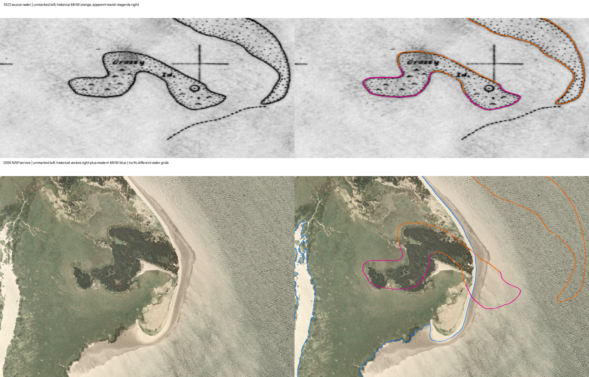

# Historical waterline and marsh segments around Grassy Island

2026-10-09 (America/New_York). Sourced draft, no independent review.

All forty historical Feature20 (mean-high-water) records were tested against the exact recorded NAIP image rectangle in NAD83 UTM10N. Three intersect: IDs22,50,52. This selection uses geometric intersection, not proximity to a preferred modern line. Within-rectangle lengths are approximately1982,297,787metres respectively; these are geometric lengths, not change measurements. One modern MHWrecord intersects the same rectangle:887366, source-date field20061009.

The complete four-panel figure was visually inspected. The historical raster labels the smaller outline “Grassy Isl.” Mean-high-water IDs50/52 and apparent-marsh49/51 occupy different segments along its drawn outline. ID22 follows the separate curving outline to the east/northeast. This source arrangement matters: the historical island outline was divided between two feature classes. The two marsh traces alone are not its complete shoreline, and the modern lack of nearby marsh-class records is not evidence that the entire island disappeared.

Placed on the separately acquired2006image without fitting, historical50falls on visible land/mixed textures, while52crosses visible land and continues toward water/pale margin. The visible part of22falls predominantly over textured water in this crop. Together with the previous49/51inspection, this documents different boundary configurations at the two recorded dates, not a uniform translation of an authenticated object. The figure does not identify species, establish exact ecological boundary, date a transition or determine its cause.

The historical source raster and vector trace agree qualitatively at the displayed drawing; this is a digitization/source correspondence check, not independent survey validation. The vector attributes identify sourceT03921, scale1:20000, planar-table source/extraction codesP, monoscopic methodM, stored source-date1922-01-01 and GISdate2006-04-24. The map title covers January–June1922; the stored January1date is not accepted as an exact observation day. IDs22/50/52 were inspected in this local crop only. The other37historical MHWrecords remain visually uninspected, and portions of22outside the crop were not audited here.

## What this changes

The comparison now has local historical waterline-coded geometry as well as marsh-coded geometry. It strengthens the reason to test a source-classification crosswalk and physical boundary evolution separately. It does not authenticate homologous modern segments or support an abrupt/global event. Ordinary erosion, accretion, vegetation change, survey/compilation differences and datum/tidal uncertainties must be tested against intermediate observations rather than selected by appearance alone.

The original October2006NOAAframes remain missing. Next retrieve a dated intermediate survey or image, authenticate the original1922symbols and revisions, and assemble a positional/tidal uncertainty budget before interpreting offset magnitudes. Two endpoint observations cannot establish rapidity, an event year, erosion rate or catastrophe mechanism.

## Reproduction and limits

[The ledger](../data/willapa-island-mhw.json) preserves selection, original attributes, within-extent lengths, crop edges and figure hash. `analysis/willapa_island_mhw.py` uses the existing historical row export, raster/world file, recorded NAIPextent and extracted modern source vectors. Historical pixel placement uses the world-file pixel-center inverse. Modern placement uses returned image pixel edges. No alignment fit or manual shift is applied.

The historical crop is a rectangle derived from inverse-projected image-extent corners; it retains its own geographic grid. The two date panels are not pixel-corresponding image warps and have different aspect ratios. Do not infer displacement by measuring screen distances between panels. Reported raster fitting residuals and modern well-defined-point accuracy do not provide a complete historical marsh/MHW error budget. June-nameNAIPimage, October-derived modernMHW and instantaneous visible water are separate observations with unresolved tide/epoch relationships.

Sources remain S251–S253, S257 and S261; these are related survey products and a separate aerial image, not independent confirmations of a common event. See [the image acquisition audit](WILLAPA-NAIP2006-IMAGE.md) and [marsh association test](WILLAPA-MARSH-COMPARISON.md).
