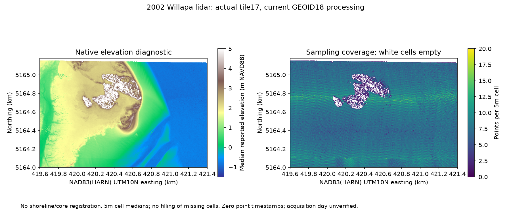

# Willapa lidar: actual elevations and validation limits

2026-10-09. S277 is the March2003 validation report prepared for NOAA by Perot System Government Services, [original nine-page PDF](https://noaa-nos-coastal-lidar-pds.s3.amazonaws.com/laz/geoid18/12/supplemental/wa2002_noaa_willapa_mudflat_m12_surveyreport.pdf). PDF4-5/printed2-3 and PDF8-9/printed6-7 were visually inspected; all24 AppendixA rows were transcribed. The full report remains a local research copy rather than a public republication. Its SHA256 is266ef9b5da1e216f380eb2c95a68ac5bb34a94cae7ffd932167e44ab39acd232.

S278 is NOAA's [actual dataset12 download package](https://noaa-nos-coastal-lidar-pds.s3.amazonaws.com/laz/geoid18/12/index.html), followed from its [InPort record48221](https://www.fisheries.noaa.gov/inport/item/48221). Original metadata, boundary,28-record tile index, range table and one actual point-cloud tile are preserved in [the source folder](../sources/originals/cascadia/willapa-lidar-2002/index.html), with a [hash manifest](../data/willapa-lidar-acquisition.json). This is current GEOID18 processing; it is not authenticated as byte-identical to the earlier GEOID12A files cited by S274.

## Ground-control reproduction

The [input ledger](../data/willapa-lidar-validation-inputs.json), [executed calculation](../analysis/willapa_lidar_validation.py) and [results](../data/willapa-lidar-validation.json) reproduce the printed control comparisons:

| Quantity | Calculated from24 printed residuals | Reported |
| --- | ---: | ---: |
| Mean ground-control minus lidar elevation | 0.1371625m | 0.1372m |
| Uncorrected RMSE | 0.1878927m | 0.1879m |
| Sample standard deviation | 0.1311757m | 0.1312m |
| RMSE after adding0.1372m to lidar | 0.1284138m | 0.1284m |
| Normal-assumption1.96×corrected RMSE | 0.2516911m | Approximately0.25m95% open-terrain accuracy |

Every corrected AppendixA entry agrees within its printed rounding. The report's Methods text says lidar-minus-GCP, whereas AppendixA and the positive-bias correction use GCP-minus-lidar. The calculation follows the explicit appendix convention; it does not silently reverse measurements. The corrected residual mean is approximately-0.0000375m. Do not add this correction again to current data merely because the original validation report specifies it: NOAA's processing lineage says the bias was already removed.

Six of30 collected controls fell outside lidar coverage, leaving24 comparisons. Controls were specified in flat, unvegetated terrain, tied to the same GPS reference network. Their printed elevations span2.56-123.39m. This is not a validation sample covering every submerged channel or vegetated marsh. The same24 controls estimate the bias and describe the corrected residuals; there is no held-out assessment here. The report's Shapiro-Wilk normality test has not been rerun.1.96×RMSE is conditional on its distribution assumption, not a guaranteed error bound at each point.

The2018 paper's0.1m elevation resolution and the tile's0.01m stored coordinate increments are different from tested accuracy. The paper approximates MTL by subtracting1m from NAVD88; the recovered validation does not authenticate that offset at each core site or tidal epoch.

## Actual point-cloud audit

The preserved file20020326_17_ld_p3.copc.laz is25,526,759bytes, SHA2566ce2dfff5ff066eded358ead7977d26c66ff1b79de2c2d6656d3b0e650bc34f5. The [audit script](../analysis/willapa_lidar_tile.py) reads all4,999,615 points; header and decoded counts agree. All points have producer class2. Decoded coordinate extrema differ from header bounds by about0.0032-0.0035m, within half the0.01m coordinate increment. This is a quantization-consistency finding, not a survey-accuracy test.

The embedded compound CRS declares NAD83(HARN)/UTM10N and NAVD88 heights. The current index additionally states GEOID18. The tile-index PRJ is projected UTM, while each record's `srs` attribute saysEPSG4957, the geographic HARN3D code. That attribute alone must not override the embedded projected CRS. Table1's core datum remains unreported; no core-point or historic-map transformation is performed.

All point GPS times are0, and the header creation date is absent. The filename'sMarch26 label is not a verified individual flight date. InPort describes March26-April24,2002coverage; its original-source lineage gives April2-24. Those different ranges remain visible. A precise tide or observation time cannot be supplied from these fields.

The declared native-coordinate window is easting419600-421400m and northing5164000-5165180m. It contains612,992 points. Of84,960 five-metre cells,80,672 contain samples and4,288 remain empty. The figure displays cell medians without filling gaps. Producer class2 does not independently establish bare-earth truth; apparent holes or smooth regions are not assigned vegetation, water or erosion causes. Colour scales clip display extremes but the [numerical results](../data/willapa-lidar-tile.json) retain point ranges. No ecological boundary, historic shoreline overlay, change rate or event footprint is inferred.

The producer rangeCSV contains literal `np.float64(...)` tuple strings instead of ordinary scalar CSV fields. It is preserved unchanged and not evaluated as code. Tile-index geometry and actual point headers were inspected separately. Only one of28 files was acquired and decoded; the complete137,478,959-point dataset has not been audited.

## What this changes

We now have actual measured elevation data and a reproduced source validation, advancing the terrain inputs needed for a physical model. We still need authenticated coordinate ties, tidal-datum conversion, source processing/version comparison, classification checks and measured depositional-unit geometry before using it to infer accumulation, displacement or sediment transport. The terrain surface cannot independently date buried deposits or establish a worldwide event.

To reproduce, install `numpy`, `laspy[lazrs]` and `matplotlib`, then run `python analysis/willapa_lidar_tile.py`. The validation calculation additionally requires the linked original report saved at `tmp/research/willapa-lidar/surveyreport.pdf`; its hash is checked before calculation. All twenty objectives remain intact and incomplete.
