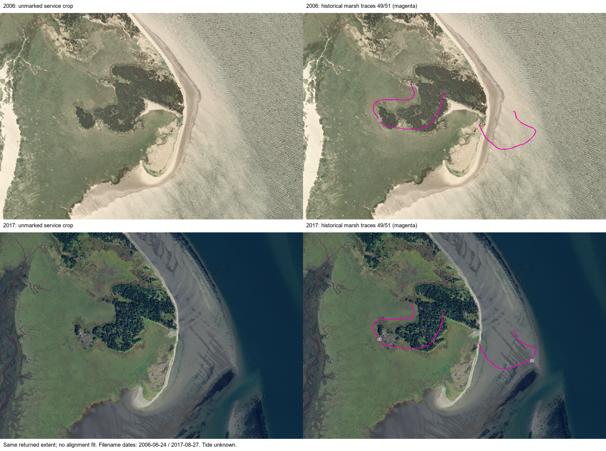

# Actual 2006 and 2017 image comparison

2026-10-09. S273 adds a later acquired image of the same Grassy Island/Leadbetter footprint used for S261. The [four-panel comparison](figures/willapa-naip2006-2017-pair.png) preserves each unmarked crop alongside the historical apparent-marsh traces. Both original crops and the finished panels were visually inspected. This is a retrospective visual comparison, not an extracted shoreline or independently reviewed change measurement.

## Acquisition and date provenance

The previously linked Washington-hosted 2017 image service failed DNS resolution. The accessible federal imagery service's public catalog lists NAIP2017_CONUS. Querying the recorded island lookup window returned two tile candidates. The selected tile is **m_4612424_se_10_1_20170827**, object87267, rather than the neighboring tile. Its catalog polygon contains all41vertices of historical49 and32vertices of51.

The crop was locked to that tile, using the exact recorded2006extent in EPSG26910 and the same1726×1177dimensions. The returned extent equals the earlier extent exactly. First three bands and nearest-neighbor interpolation were requested. This proves request/output consistency; it does not authenticate native positional accuracy or the server's datum operation. No alignment fit, manual image adjustment or boundary shift was applied.

The 2017 filename encodes August27. A separately queried acquisition-date layer, WA54, returns OBJECTID19 with date1503813600000, represented as2017-08-27T06:00:00UTC. All73historical vertices are covered by that date polygon under an even-odd ring test. This strengthens the producer-reported day association. The timestamp is **not authenticated flight exposure time**; no tide was calculated from it. Both metadata routes belong to the same imagery program and are not independent observations. The2006June24date remains a filename association in the earlier ledger.

Original responses, image bytes, parameters and hashes are recorded in the [2017acquisition ledger](../data/willapa-naip2017-acquisition.json). The [acquisition script](../analysis/acquire_willapa_naip2017.py) supplies the retrieval method. The [panel script](../analysis/willapa_naip_pair.py) checks stored source hashes, dimensions, extents and date-polygon inclusion, then records the [panel ledger](../data/willapa-naip-pair.json). These checks establish reproducible placement, not shoreline equivalence or scientific validation.

## Visible result and its limits

The broad land configuration appears in both images. Historical49lies over land with vegetation/tree textures in both. Historical51crosses the eastern water or exposed-flat margin;2017shows substantially more visible flat/channel texture there, while2006shows bright/rippled water and a narrower visible margin. Tree/grass texture and appearance also differ. Those differences cannot be converted into sediment thickness, species, age, a deposition date or erosion/accretion magnitude from these crops alone.

Unknown tides, exposure times, seasonal vegetation and radiometry prevent equating the instantaneous water edge across years. Persistence of a broad land mass does not prove an unchanged marsh boundary. Conversely, different exposed margins do not prove abrupt upheaval. The historical curves are retained in their recorded position rather than fitted onto a preferred modern feature.

S272's rapid-assessment records3299/3382remain unquantified: these images do not retroactively supply their missing dates, feature types, rate or numerical noise threshold. The spatial pattern weakens an interpretation that the missing modern apparent-marsh records alone demonstrate total island disappearance; it does not resolve the1922–1953–modern feature lineage or permanent attachment history.

Next retrieve the original historical photo1613/annotated field sheet, identify homologous physical boundaries, and establish image-registration/tidal/feature uncertainty before measuring change. The requested worldwide geography and catastrophe model remain incomplete, with no prospective confirmation or independent review.
