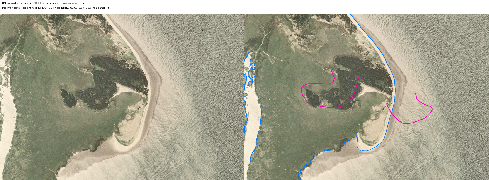

# Willapa island traces against a separate 2006 aerial image

2026-10-09 (America/New_York). Sourced draft; no independent review.

## Retrieved observation

S261 is an unchanged rendered PNG response from the public NAIP2006 image service, accompanied by the unchanged service, catalog-query and export-response JSON. The directory `sources/originals` preserves retrieved response bytes; this image is a service-rendered derivative, not a native original raster or an October NOAA photograph.

The catalog-selected raster is `n_4612424_se_10_1_20060624`, object ID 30556 at retrieval. Its year field is 2006; its name encodes June 24, 2006. This is not independent authentication of an original exposure timestamp. The acquisition script locks that raster explicitly and requests a 1726 by 1177 pixel PNG in NAD83 UTM zone 10N. Recorded URLs, request parameters, returned extent and all response hashes are in [the acquisition ledger](../data/willapa-naip2006-acquisition.json). A future service object ID or export URL may change.

## Placement and inspected features

The left panel retains the image without annotation. The right places historical apparent-marsh traces 49 and 51 in magenta and modern mean-high-water feature 887366 in blue. Both panels use the same extent. No alignment fit, manual offset or shoreline substitution is applied. The historical vector vertices (41 and 32) all lie inside the selected catalog footprint. This does not authenticate native valid pixels or full photographic coverage.

The complete crop and paired figure were visually inspected. Trace 49 falls across visible land with mixed green and dark textures, including areas with a coarse, canopy-like appearance. Much of trace 51 falls over textured water or the pale band beside the visible land margin. The modern high-water line broadly follows that margin, while showing local differences from image tone boundaries. Its source-date field is October 9, 2006; the image's encoded date is June 24. These observations do not identify vegetation species, tidal elevation, marsh ecology or a homologous boundary.

## Inference and limits

The two unmatched historical apparent-marsh traces have different modern image contexts. Their kilometre-scale nearest same-class distances therefore cannot be read as island migration. The image provides a visible local surface at both placements, narrowing a generic missing-image explanation for this separate NAIP observation. It does not establish complete coverage in the NOAA compilation or explain why that compilation lacks nearby apparent-marsh records.

For 49, surviving land is visible at the recorded placement, but the historic marsh classification and vegetation history remain unresolved. For 51, the placement over water/pale margin warrants a source-symbol, revision and physical-change investigation. Datum realization/epoch, original survey accuracy, service positioning and local shoreline evolution must be assessed before interpreting an offset as erosion, subsidence or movement. Neither trace supplies a catastrophe date.

Nominal one-metre source resolution is not one-metre positional accuracy. Server reprojection and its default datum operation were not independently reproduced; no explicit datumTransformation was requested. The image tide and original exposure time are unknown. Mean high water, instantaneous visible water and apparent marsh are different observations. No signed displacement, annual rate or significance is calculated.

The named October NOAA roll 0605R10 frames remain unrecovered and uninspected. Next authenticate the historical symbols/feature identity, inspect the historical mean-high-water traces independently, and recover the original October images if openly available. The June service crop cannot replace them. See [the exact coverage and photo inventory](WILLAPA-ISLAND-COVERAGE.md).

## Reproduction

`analysis/acquire_willapa_naip2006.py` acquires live service responses; re-execution can change response bytes and temporary URLs. `analysis/willapa_naip_overlay.py` reads recorded responses, verifies all four hashes and dimensions, checks catalog-footprint vertex inclusion, and renders the figure using the returned extent. It requires the previously acquired historical row export and extracted WA0401D vectors. [The overlay ledger](../data/willapa-naip2006-overlay.json) records placement, candidate attributes and figure hash. These are provenance and calculation checks, not independent scientific validation.
