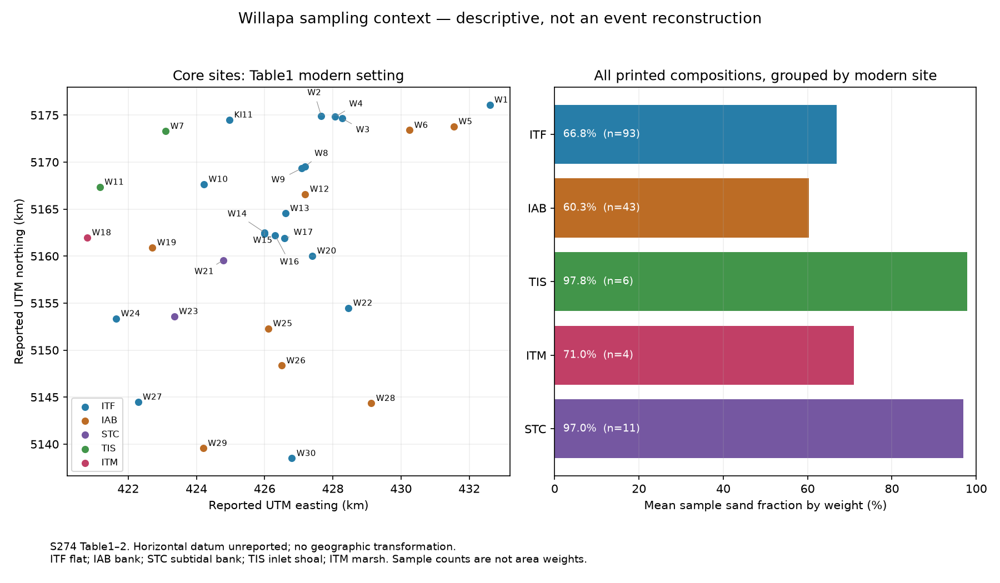

# Willapa core sampling and spatial extrapolation

2026-10-09. S274, Peterson and Vanderburgh (2018), [preserved original](../sources/originals/cascadia/willapa-tidalflat-2018.pdf). PDF9-10/printed117-118, including Figure6 and all40 Table1 rows, were visually inspected. The [site ledger](../data/willapa-sites.json) retains original coordinates, modern environment, mean-tidal-level elevation, approximate length and shortening. The [executed script](../analysis/willapa_site_audit.py) joins these site identifiers to the literal [grain ledger](../data/willapa-grain-inputs.json) and preserves [results](../data/willapa-site-audit.json).

The plot uses reported UTM coordinates without a geographic transformation. Table1 says UTM sector10T but does not declare the horizontal datum. Elevations are relative to mean tidal level, not NAVD88. These points are not registered to the historical island traces, Ecology lines or aerial imagery. Missing datum information remains null. Plot axis scales differ; use the ledger, not image distances, for coordinate calculations.

## Environment-specific composition

The recovered31 vibracore sites include30 W sites plus the earlier KI11 core. Eight T sites are marsh gouge-core locations; G1 is an exhumed stump location, not a recovered sediment column. The20 apparent-zero sections assumed in the budget are not individually identified by this ledger and are not assigned invented site/depth associations.

| Table1 modern setting | Vibracore sites | Table2 composition entries | Mean sand by weight | Equal-core mean sand |
| --- | ---: | ---: | ---: | ---: |
| Intertidal flat, ITF | 18 including KI11 | 93 | 66.839% | 66.555% |
| Intertidal accretionary bank, IAB | 8 | 43 | 60.256% | 58.456% |
| Subtidal channel bank, STC | 2 | 11 | 97.000% | 96.883% |
| Tidal inlet shoal, TIS | 2 | 6 | 97.833% | 97.875% |
| Intertidal marsh, ITM | 1, W18 | 4 | 71.000% | 71.000% |

These are sample summaries, not environment-area fractions or independent estimates of baywide composition. W18's buried sequence average is not the surface sand fraction of all marshes; modern labels do not classify each buried layer's depositional environment. The paper explicitly chose representative sites and two denser clusters rather than a declared probability sample. Core counts and sample counts cannot be substituted for measured area weights.

## Selection changes the extrapolation

The full157-composition average is68.439%; adding the20 assumed zeros gives60.706%. Excluding the11 samples from Table1's modern STC sites gives146 measured compositions averaging66.288%; adding20 zeros then gives58.301%. Restricting to the93 ITF compositions and adding20 zeros gives55.009%. Using only the ten dated Table4 sites yields53 compositions averaging60.302%, or43.781% after those20 zeros.

These are declared diagnostics, **not alternative authenticated baywide estimates**. Keeping the same20 assumed zeros while changing the other selection also changes their relative influence. The source's original selection, environment areas, sampling depths, and correspondence of composition to accumulation-rate sites are required for defensible extrapolation. The paper's statement that subtidal sinks were excluded from its area estimate does not authenticate which Table2 samples entered its composition calculation.

## Conflicts and coverage limits retained

Table1's30 W sites comprise17 ITF and8 IAB, whereas PDF8's prose describes18 ITF and7 IAB. Including KI11 increases the table's ITF count to18 but also increases total sites to31; that does not reconcile the claimed30-site census. W19 is IAB in Table1. PDF14 text calls W19 and W21 subtidal banks; PDF11 text and Table1 instead identify W21 and W23 as subtidal. The later prose portions were read as text, not independently inspected as scans in this release. No classification is silently changed to fit a count.

Table1 lists17 numeric W-site shortening values, averaging8.235%, with a0-16% range. Including KI11 gives18 values averaging8.333%, consistent with the prose's rounded8% mean and18-core count, but not its2-16% range: W11 is printed0%, W2 and W3 are1%. This supports part of the summary while retaining the conflicting range. Missing shortening is unknown; no compaction correction is applied.

Three reported composition-bin starts lie below Table1's approximate core lengths, even allowing half0.1m printed-length precision: W12 has a2.5-3m sample versus2.0m length, W28 likewise, and the note-only W29 sample is3.5-4m versus3.0m length. Pull-out loss, gaps, penetration versus recovered-length conventions, or table error may matter. Original logs are needed; no sample is discarded, relocated or declared fabricated. T7's source note places its modern marsh core top below artificial fill, so it is not an undisturbed modern surface benchmark.

## Consequence for a physical reconstruction

The present record supplies real spatial and environmental inputs, but no authenticated common event horizon. A baywide model must distinguish depositional facies, core recovery and coordinate references; use measured area/depth weights; define weight-to-volume conversion; and account for sediment sources and sinks. The existing approximately57millionm³ product remains conditional, not a measured event deposit.

Next recover original logs and the analysis selection, authenticate datum/elevation ties, and obtain dated unit thicknesses and environment areas. Compare tidal/channel migration, post-subsidence infilling, storms and rapid-event transport against the same spatial observations. This audit establishes no global event, chronology transformation, independent review or prospective success. All twenty objectives remain in scope.
