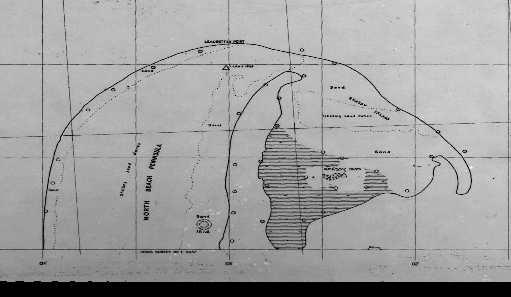

# Intermediate Grassy Island survey and its observation dates

2026-10-09 (America/New_York). Sourced draft; no independent review.

The NOAA [T-09634S package](https://nsde.ngs.noaa.gov/downloads/T-09634S.zip), S265, supplies a covering raster and combined T-9634 topographic/shoreline report. The downloaded raster depicts Grassy Island within a continuous outer sand outline adjoining Leadbetter Point, with an internal dotted boundary, sand/dune labels and hatched areas. This is an intermediate mapped configuration to compare with the previously inspected 1922 and 2006 records. It is not yet an independently dated island-attachment event.

The crop is an unmarked rectangular extraction, pixel edges [3250,2300,5700,3728], from the 7687x3728 raster. No tracing, image warp, fitted alignment or displacement calculation was performed. Original [raster](../sources/originals/cascadia/T-09634S/t09634s_dd.jpg), [world file](../sources/originals/cascadia/T-09634S/t09634s_dd.jgw), [metadata](../sources/originals/cascadia/T-09634S/t09634s.met) and [34-page report](../sources/originals/cascadia/T-09634S/T-9634.PDF) are preserved byte-for-byte. The [acquisition ledger](../data/willapa-t9634-acquisition.json) records archive/member hashes and inspection scope.

All 34 report pages have been visually inspected as rendered scans, including the first five inspected previously. Some field-edit pages are degraded; there is no exhaustive control-table transcription or OCR claim. The adjacent T09637N raster was inspected locally and stops south of the target; its report remains uninspected. It is a retrieval lead because T9634 explicitly places field/photogrammetric plot reports with T9637 (PDF11/26/27).

## Dates have different roles

| Record | Date or scope | Evidential role |
| --- | --- | --- |
| Photo1613, topographic form PDF5 | July11,1950,13:54 PST;1:24000;predicted2.4ft above MHW | Source photograph record; original exposure not recovered |
| Photos7183-7184/7203-7204, PDF5 | June16,1951;1:40000 | Other topographic source photographs, not automatically island observations |
| North Beach MHW location, topographic form PDF4 | June30,1953,planetable on enlarged photo1613 | Boundary-location record |
| North Beach shoreline narrative, PDF29 | June6,1953,planetable on photo1613 | Conflicting field date; retain both |
| Shoreline photo series1607-1615, PDF25 | July11,1950,13:53;1:24000;predicted2.4ft above MHW | Series-level time differs from single-frame form; not corrected silently |
| Field-edit report, PDF14 | November23,1956 | Later editing, not universal shoreline observation date |
| Topographic review, PDF20; shoreline agreement, PDF34 | January6,1958 | Review/version records |
| Combined cover, PDF1 | June5,1958 | Cover date |
| Raster metadata | June6,2003 process; source date unknown | Georeferencing/digital processing, not physical observation |

PDF22 identifies a distinct 1:10000 shoreline manuscript registered February13,1955; the topographic form PDF2 identifies 1:17000 compilation and February13,1957 registration. The catalog lists1956/1:17000, while raster metadata gives1:10000. The combined report's multiple products offer a possible explanation, but the exact manuscript-to-downloaded-raster crosswalk is unresolved. A single year or scale must not be chosen merely to reconcile the records.

The shoreline compilation (PDF29) specifically links North Beach Peninsula to photo1613 and June1953 field location. Other shores use June1953 small-island work, March1954 supplied photo annotations or October1954 hydrography. These are not simultaneous observations of all boundaries.

## Accuracy and revisions constrain comparison

The topographic summary PDF7 says the map does not meet National Standards of Map Accuracy. PDF20 repeats the warning with a handwritten contour qualification. PDF18 says no horizontal field-edit accuracy test was made and no vertical test was required or made. Clouded photography and contour gaps are discussed on PDF11. These statements do not supply a measured error distribution for Grassy Island.

PDF15 says ocean shoreline field editing was omitted, retaining an earlier field-inspection state; an annotation points to the special shoreline report. This qualification cannot be transferred automatically to every bay-side island boundary. PDF34 reports agreement between the shoreline and topographic manuscripts, which is a shared-compilation relationship, not independent confirmation.

Original reports use NA1927; the distributed georeferenced raster declares NAD83. Those are distinct coordinate stages. Raster metadata reports x/y fitting RMS0.972/1.643m; those residuals are not original field accuracy. Tide stages are predicted, and no matched modern exposure/tidal surface has been established.

## Local mechanisms are documented alternatives

The special Cape Shoalwater report, PDF33, describes seasonal beach-height changes and northward harbor-entrance migration, with a severe1952storm and subsequent storms contributing to erosion. It relays Fisheries observations of summer buildup/winter loss, including about4ft winter lowering around Leadbetter Point, and estimates a3ft vertical beach change could shift MHW about100ft. It distinguishes this beach proxy from an approximately stable seaward grass limit. These are source reports and estimates, not independently measured changes at our chosen island traces.

The same page describes MHW mapping at3.4ft above mean sea level with approximate mile-spaced ties in the Cape Shoalwater remapping. That local method must not be applied to Grassy Island without the relevant sheets. PDF21 reports North Beach peninsula buildup since the GLO survey; the original GLO date and geometry remain needed.

The map strengthens a testable sequence of differing coastal configurations. It supplies neither a catastrophe date nor a change rate or cause. Next recover photo1613, the June1953 planetable sheets, and T9637-bound reports; cross-identify the raster manuscript and authenticate the line symbols before computing comparable boundary change. The missing Phipps photo plates remain missing. All twenty original outcomes remain in scope.
