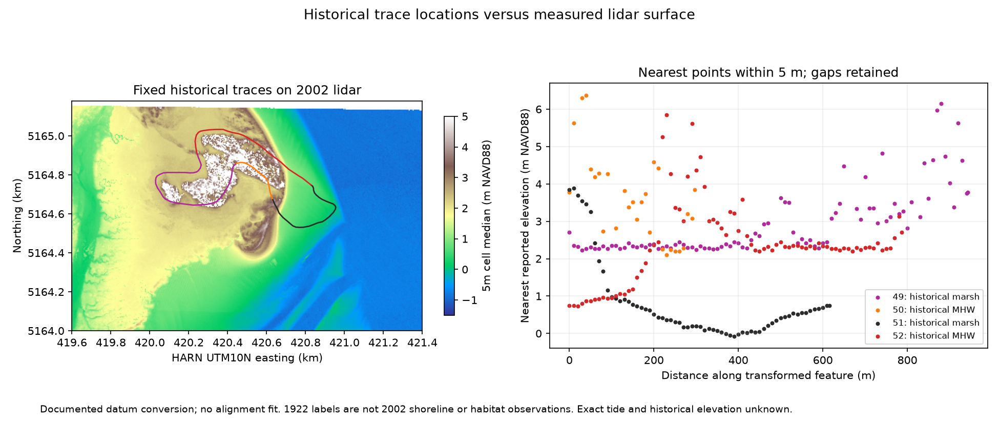

# Historical Willapa traces on measured 2002 terrain

2026-10-09. This retrospective diagnostic joins S253's stored NAD83 historical geometry to S278's measured lidar using S279's documented horizontal datum grids. It measures the later surface near mapped historical locations. It does not recover historical elevations or measure deformation.

## Sources and conversion

The four selected records are OBJECTIDs 49/51 (Feature15, apparent marsh) and 50/52 (Feature20, mean high water) in `wc46c03lines_83`. All cite T03921. Their stored January1,1922 date is a catalog label, not an authenticated observation day; the source sheet covers January-June1922. April24,2006 is the digitization date. The earlier [paired datum audit](WILLAPA-DATUM-COMPARISON.md) checks the stored NAD83 copy against its projected predecessor; that numerical agreement does not establish field-survey accuracy or observation epoch.

The target is the horizontal CRS embedded in the preserved [actual lidar tile](WILLAPA-LIDAR-VALIDATION.md): NAD83(HARN)/UTM10N. Its heights remain NAVD88. The [PROJ grid catalog](https://cdn.proj.org/) identifies both `us_noaa_nadcon5_nad83_1986_nad83_harn_conus.tif` and Washington `us_noaa_WO.tif` as NAD83-to-HARN grids. Original grid bytes and SHA256 hashes are retained. PROJ9.8.1/pyproj3.8.0 exposes two available operations, each with a stated0.05m operation accuracy. That figure is not historical-map accuracy.

The [script](../analysis/willapa_trace_elevations.py) disables network access and ballpark operations, checks grid/tile hashes, and records both pipelines. Operation47 (NADCON5) is the declared primary; operation28 (Washington grid) is retained for sensitivity. Maximum difference at the historical vertices is0.024715m. Their maximum geodesic inverse-roundtrip residuals are below0.000002m; these are numerical consistency checks, not physical survey error bounds. No translation, rotation or fitted registration is applied.

## Measured-point sampling

Each part is sampled every10m, including its endpoint. A horizontal nearest-point query searches all4,999,615 decoded tile points. The declared5m and10m search radii are diagnostic choices, not validated map-error budgets. Missing matches remain gaps; no elevation is interpolated. The [result ledger](../data/willapa-trace-elevations.json) retains every query location, nearest point index/distance, inclusion flag and accepted elevation.

| Historical record | Boundary class | Queries | Matches within5m | Median within5m, m NAVD88 | Median within10m, m NAVD88 |
| --- | --- | ---: | ---: | ---: | ---: |
|49|Apparent marsh|96|91|2.442|2.477|
|50|Mean high water|31|28|3.522|3.522|
|51|Apparent marsh|63|63|0.472|0.472|
|52|Mean high water|80|80|2.302|2.302|

All270 queries have a match within10m. Within each record/radius every accepted query has a distinct nearest point, though spatial dependence persists. The alternate operation is tested on the same geographic query locations: it changes nearest-point identity once for49 and twice for51, with zero changes for50/52. No radius-inclusion counts or medians change under that operation. This tests conversion sensitivity; it does not test alternative historical registrations or map error.

The left panel shows5m cell medians, with empty cells blank and display scale clipped from-1.5to5m. The right panel uses actual nearest-point heights, without filling the eight5m-match gaps. Both panels were visually inspected. High values on some trace portions remain in the ledger; producer class2 is not independently authenticated bare-earth classification.

## Interpretation and next discriminating evidence

The two apparent-marsh traces occupy different measured2002 elevation settings. Their1.970m median difference compares two locations at one later survey epoch; it is not1.970m of subsidence, uplift or accumulation. The historical MHW traces likewise lie across a range of later elevations, rather than supplying a calibrated tide-level change. Earlier [2006/2017 imagery](WILLAPA-NAIP-PAIR.md) adds land/water context but cannot establish a homologous ecological boundary or cause.

No exact lidar exposure time/tide is recoverable from this tile's zero GPS times. Historical positional uncertainty, legend/revision authentication, tidal datum conversion and equivalent repeated boundary observations remain needed. The 2002 terrain supplies a baseline for later comparisons, not present-day terrain. The core table's horizontal datum is unknown and its elevations are MTL; no core overlay or guessed one-metre conversion is made.

To distinguish gradual shoreline/channel change from a rapid event, recover comparable dated boundary observations and in-place stratigraphic contacts with authenticated coordinates, elevations and ages. Test whether a specified event footprint and deposition/displacement model fits them better than the declared local alternatives. The current result supplies spatial terrain inputs, without dating an event or establishing the global reconstruction. All twenty objectives remain active; no independent review or prospective confirmation follows.

Reproduce with `numpy`, `laspy[lazrs]`, `pyproj`, `scipy`, `shapely` and `matplotlib`, then run `python analysis/willapa_trace_elevations.py` from the repository. The script uses the preserved originals and writes the JSON ledger and figure.
